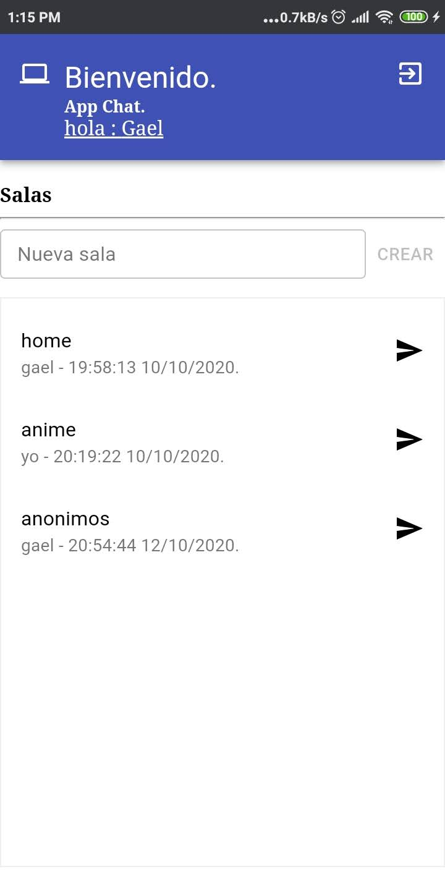

# Chat app

### Este es un ejemplo de como implementar websoket con django con la libreria de channel de python e interactuar con el mediante un front-end en ReactJS usando las practicas de redux implemtetando rutas y manejo de estado de forma asincrona.

## Requerimientos
- python 3.7 o superior.
- pip para installar los requerimientos.
- node minima version 10, instala paquetes que se encuentran en la carpeta frontend en el archivo packaje.json.

## instalacion de requerimientos.
- ```pip3 install -r requirements.txt ```( de preferencia en entorno virtual).
- en carpeta frontend ejecutar ```yarn install``` o ```npm install```.

## ejecucion en desarrollo.
- entorno de python.
    - ```python3 manage.py runserver```
- nodeJS.
    - ```yarn start``` o ```npm start```.

## Produccion
- Crear compilado de front.
    - ```yarn build``` o ```npm run build```
- Recolectar archivos estaticos.
    - ```python manage.py collectstatic```
- correr servicios web.
    - ```daphne config.asgi:application -p $PORT --bind 0.0.0.0 -v2```
- worker.
    - ```python manage.py runworker -v2```

## Capturas de pantalla 

<div style={{dispay:'inline-block',margin:'auto'}}>
    
    
    
    
</div>

## [ver muestra de aplicacion ](https://chatbasico06.herokuapp.com/)
